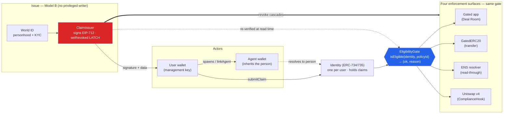

# PassportKit Node

**Reusable onchain-identity + compliance-credential rails for wallets, apps — and agents.**

ETHGlobal Lisbon 2026 · Continuity track · forked from the public PassportCreds demo


> **Thesis:** _identity before access, compliance before liquidity._
> **One decision core, four enforcement surfaces, humans AND agents.**
> The hero of this demo is the **REFUSAL** — the revocation cascade, not the green check.

---

## System at a glance

One decision core (`EligibilityGate`); every surface asks it the same question. **Revoke one claim → every surface refuses in the same block.**



**Read it in one line:** World ID (or a mock attester) makes the `ClaimIssuer` _sign_ a claim → the **user submits it themselves** to their own Identity → every surface reads the **same** `EligibilityGate` → the issuer's `setRevoked` **latch** flips all of them at once.

---

## What it is

A user's wallet is the **management key** of their own on-chain **Identity** (ERC-734/735). A trusted **issuer only signs** claims off-chain (EIP-712); the **holder submits their own claim** — nobody writes to another user's identity (**Model B, no privileged writer**). Trust is the signature, re-verified at read time by the gate, so the holder can never override a platform decision.

- **World ID** is the one _real_ verification — personhood and document-backed KYC become on-chain compliance claims. (KYC / accredited attesters are **labeled mocks** behind the same interface.)
- **Revocation = a latch** (`ClaimIssuer.setRevoked`). While latched, `isClaimValid` is false → every surface refuses **and** no fresh claim can land. Only the issuer re-opens.
- **Zero PII on-chain** — a claim's `data` is `abi.encode(dataHash, expiresAt, nonce)`, a hash/reference, never personal data.
- **Free exit** — compliance blocks movement to a counterparty (transfer / swap), never your own exit (burn / removeLiquidity). Funds are never trapped.
- **Agents inherit eligibility** — a person spawns an agent (a new wallet) linked to their identity via `linkAgent` (Model A). The agent acts under the person's credentials. **Revoke the person → their agents are blocked too.**

---

## Live on Ethereum Sepolia

Deployed 2026-07-25 · startBlock `11350114` · admin / agent / issuer-signer `0xEc98B58F86a32aAd7B32E17f292e6B640487f2A4`

| Contract | Address |
|---|---|
| **EligibilityGate** ⭐ | [`0x51574D5830461FD38022987621C7bdf3a996b8d1`](https://sepolia.etherscan.io/address/0x51574D5830461FD38022987621C7bdf3a996b8d1) |
| PassportResolver | [`0x36064023898d0451C6763a171e080b18123BE83E`](https://sepolia.etherscan.io/address/0x36064023898d0451C6763a171e080b18123BE83E) |
| IdentityFactory | [`0x23504699EAcc1842d01998C0D57C53a2CF1638A0`](https://sepolia.etherscan.io/address/0x23504699EAcc1842d01998C0D57C53a2CF1638A0) |
| ClaimIssuer | [`0x56F97734cC4d80af950538eAA6976398b5E58Fa9`](https://sepolia.etherscan.io/address/0x56F97734cC4d80af950538eAA6976398b5E58Fa9) |
| IssuerRegistry | [`0xcAa549B8f1ef449BEeD00D7Bb88a828AB9E70AE7`](https://sepolia.etherscan.io/address/0xcAa549B8f1ef449BEeD00D7Bb88a828AB9E70AE7) |
| GatedERC20 | [`0xe3a29101263567c400A0d4d47C52912d3Ed0a08d`](https://sepolia.etherscan.io/address/0xe3a29101263567c400A0d4d47C52912d3Ed0a08d) |
| ScoreRegistry | [`0x010c452FEC23669Be2D076Efe0CAEEb28c82Aa6E`](https://sepolia.etherscan.io/address/0x010c452FEC23669Be2D076Efe0CAEEb28c82Aa6E) |
| PassportSubnameRegistrar | [`0xb41FfDBeB9Ac19359D861AB13F3E05356B68a34B`](https://sepolia.etherscan.io/address/0xb41FfDBeB9Ac19359D861AB13F3E05356B68a34B) |

> `Identity` is deployed **per user** by the `IdentityFactory`, so it has no fixed address here.
> The **Uniswap v4 hook** and the **agent/concierge** layer run on **local anvil** via `make demo` (not part of the Sepolia core deployment).

**Live ENS (verified on-chain, no keeper):**

```bash
R=0x14a83c7aE0667e90ff3863C6eF12539F67e4Cd58   # DEMO PassportResolver
RPC=https://ethereum-sepolia-rpc.publicnode.com
cast call $R "text(bytes32,string)(string)" $(cast namehash luiz.casaazul.eth) "compliance.status" --rpc-url $RPC
# -> GREEN   (revoke the claim and the very next lookup returns REVOKED)
```

- `luiz.casaazul.eth` → `compliance.status = GREEN`
- `bot.luiz.casaazul.eth` → `agent-registration = "1"` (ENSIP-25) + `agent.reputation = "87"`

Full address list: [`docs/DEPLOYMENTS.md`](docs/DEPLOYMENTS.md).

---

## The demo — one command, one site

```bash
npm install
make demo          # starts anvil, deploys one world, serves the site on :3003 (DEMO_MODE=true)
```

A visitor connects a wallet once on the landing page and walks all four surfaces — one wallet, one chain, all the way through:

| Step | Route | What happens |
|---|---|---|
| **1. Get verified** | [`/passport`](http://localhost:3003/passport) | World ID Selfie Check → `PROOF_OF_PERSONHOOD` (Passport **LIMITED**), then World ID Identity Check (18+) → `KYC_VERIFIED` (Passport **GREEN**). Identity is created; the **user** submits each claim; the ENS name resolves live. |
| **2. Enter the room** | [`/deal-room`](http://localhost:3003/deal-room) | The gated app asks the `EligibilityGate`, never for a document. |
| **3. Trade the pool** | [`/markets`](http://localhost:3003/markets) | Uniswap v4 pools on that same gate; non-compliant swaps revert `NotCompliant(wallet, reason)`, exit is always free. |
| **4. Mandate an agent** | [`/concierge`](http://localhost:3003/concierge) | A house agent (a linked wallet) pays bills only while its human owners stay compliant — autonomous (x402) + owner-approved (m-of-n) rails. |

**The money moment:** revoke one claim on `/markets` → the Deal Room locks, the GatedERC20 transfer fails, the ENS record flips to `REVOKED`, the v4 swap reverts, and the agent is refused — **all at once.**

```bash
make demo RPC_PORT=8546 WEB_PORT=3010   # run a second world beside an existing one
make demo-stop                          # stop the site; kills the chain only if make demo started it
make demo-explorer                      # Otterscan over the demo chain on :5100
make up                                 # full product stack: db + api + cre + web on :3000
```

**Starting state (anvil dev accounts):** **operator** (KYC + accredited, admin, issuer signer, LP), **ana** (KYC, house co-owner), **rui** (identity, no claims — verified live in the demo), **concierge** and **plumber** (no identity). The house holds mUSD and has granted the concierge a per-tx CASA mandate.

> **`DEMO_MODE=true` lets anyone who can reach the server sign with the anvil keys — it belongs on a laptop, never on a deployment.** `apps/web` ships two non-interchangeable templates: **`env.example`** (local demo — `DEMO_MODE`, `RPC_URL`, actor keys) and **`.env.example`** (hosted Sepolia product pages, demo runtime off).

---

## Architecture

**Key invariants**

- **Model B — no privileged writer.** The issuer only *signs*; the user submits their own claim. The gate re-verifies with the `ClaimIssuer` on every read.
- **Revocation = a latch** (`setRevoked`). One flip refuses every surface and blocks fresh claims until the issuer re-opens.
- **Agent identity (Model A).** `identityOfWallet[agentWallet] = personIdentity` — the agent inherits the person's eligibility.
- **Free-exit.** Compliance gates the counterparty, never your own withdrawal.
- **Zero PII on-chain.** `data = abi.encode(dataHash, expiresAt, nonce)`.

Deeper detail: [`docs/architecture.md`](docs/architecture.md) · [`docs/contracts-reference.md`](docs/contracts-reference.md) · [`docs/HANDOFF.md`](docs/HANDOFF.md). Design source of truth: [`CLAUDE.md`](CLAUDE.md).

---

## Contracts (`contracts/`, Foundry)

**14 deployable contracts** across 15 `.sol` files. **132 tests / 15 suites** (`forge test`).

**Core — identity + gate + surfaces (deployed to Sepolia):**

| Contract | Role |
|---|---|
| `IssuerRegistry` | Which issuers are trusted per claim topic (enumerable `issuersForTopic`). |
| `ClaimIssuer` | Signs claims (EIP-712); authority on validity; `setRevoked` latch; `setSigner` global kill switch. |
| `Identity` | The user's ONCHAINID (ERC-734 keys + ERC-735 claims), one per user. |
| `IdentityFactory` | Creates Identity; resolves `wallet → identity`; `linkAgent` / `unlinkAgent` (Model A). |
| `EligibilityGate` ⭐ | `isEligible(identity, policyId) → (ok, reason)` — the one read every surface uses. |
| `GatedERC20` | Permissioned ERC-20; `_update` gated (mint/transfer gated, burn free). |
| `ScoreRegistry` | Per-agent reputation store; surfaced live via ENS. |
| `ens/PassportResolver` | Tenant-aware ENS resolver; `compliance.status` + ENSIP-25 `agent-registration` + `agent.reputation`, computed live in the `eth_call` — no `setText`, no keeper, no cache to invalidate. |
| `ens/PassportSubnameRegistrar` | Issues `user.tenant.eth` subnames by code, binds node → identity. |
| `libraries/Types` | Shared vocabulary (key purposes, claim topics, reason codes). Not deployable. |

**Uniswap v4 + agent economy (local anvil demo):**

| Contract | Role |
|---|---|
| `hooks/ComplianceHook` | v4 hook; `beforeSwap` / `beforeAddLiquidity` gate on the same `EligibilityGate`; remove-liquidity ungated. |
| `demo/DemoPositionRouter` | Caller-bound LP router (positions keyed by `msg.sender`). |
| `agents/HouseToken` | ERC-20 "CASA" house scrip; only the treasury mints; `reclaim` claws it back. |
| `agents/HouseTreasury` | House governance: owners, m-of-n approval queue, the concierge mandate, `isAgentInGoodStanding` (re-checks owners live on the gate). |
| `agents/MandateHook` | v4 hook gating the CASA/mUSD pool; agent swaps within cap while its owners stay compliant. |

**Enforcement surfaces = 4:** gated app (Deal Room) · GatedERC20 · ENS resolver · Uniswap v4 hook. The concierge is the agent-economy expression of the same gate. Claim topics: `PROOF_OF_PERSONHOOD` · `KYC_VERIFIED` · `ACCREDITED_INVESTOR`.

---

## Backend API (NestJS, `apps/api`)

`walletAddress` is the identity. Active endpoints:

| Endpoint | Purpose |
|---|---|
| `POST /identity/create` | Agent role provisions the user's Identity via `IdentityFactory.createIdentity`. |
| `GET /eligibility/:wallet` | Resolves wallet → identity → `isEligible` for the relevant policies (badges + access state). |
| `GET /issuer/signer` | The issuer signer address. |
| `POST /issuer/mock-claim` | `DEMO_MODE` — issuer signs a claim `{ signature, data }` the **user** submits (Model B). |
| `POST /issuer/revoke` | `DEMO_MODE` — `ClaimIssuer.setRevoked(identity, topic, true)` (the money moment). |
| `POST /world/request` | World ID — RP-signed request to open the widget. |
| `POST /world/verify` | Verifies the World proof, returns a signed personhood/KYC claim for the user to submit. |

Legacy PassportCreds modules (`cre`, `attester`, `verification`, `webhooks`, `passport`, `access`, `transactions`, `wallets`) are kept but not wired into the new flow.

---

## Repo layout

```
contracts/     Foundry — identity, gate, surfaces, v4 hook, agent economy (+ tests)
    script/DeployPassportKit.s.sol   the Sepolia core
    script/DeployAll.s.sol           the one local demo world (v4 pools + treasury)
apps/api/      NestJS — identity creation, eligibility, issuer signing, World ID
apps/web/      Next.js — /passport, /deal-room, /markets, /concierge
    src/app/api/demo/**              the demo runtime (local anvil only, 403 unless DEMO_MODE)
    src/lib/demo/                    deciders · evidence · x402 · decode · positions
cre/           Chainlink CRE workspace (legacy PassportCreds flow)
demo/          Synthetic compliance documents + AI prompts
docs/          Architecture, deployments, contracts reference, specs, prompts, World ID testing
```

The Uniswap hook and concierge demos used to be two standalone node servers on `:4180` / `:4190`; they are now the `/markets` and `/concierge` routes on the site above — same wallet, same chain, same design.

---

## Run / develop

```bash
# Contracts
cd contracts
git submodule update --init --recursive     # OpenZeppelin + forge-std (v4 suites also need the v4-core submodule)
forge test                                   # 132 tests / 15 suites
forge script script/DeployPassportKit.s.sol --rpc-url $RPC_URL --broadcast --verify

# Backend (apps/api) — copy .env.example; DEMO_MODE=true enables the issuer/revoke endpoints
npm run dev:api

# Frontend (apps/web) — copy .env.example (NEXT_PUBLIC_* gate/World/ENS vars)
npm run dev:web        # standalone dev on :3000  (or `make demo` for the full one-world site)
```

Requires Node ≥ 20 and Foundry. Workspaces: `apps/api`, `apps/web`, `cre`.

---

## Boundaries / honesty

- **World ID is real** (personhood + document-backed KYC). **KYC / accredited attesters are labeled mocks** — regulated / TEE providers plug into the same interface later.
- **No hard-coded demo values** — ENS resolves live on-chain.
- **Zero PII** is stored or written on-chain.
- **New, public code only** — nothing from any private production codebase.
- **AI-assisted, attributed** — see [`AI-USAGE.md`](AI-USAGE.md); specs and prompts ship in [`docs/`](docs/). Base-vs-delta disclosure in [`WHATS-NEW.md`](WHATS-NEW.md).

## Documentation

| Doc | Description |
|---|---|
| [Architecture](docs/architecture.md) | Actors, stack, data flow, design decisions |
| [Handoff](docs/HANDOFF.md) | Current status, flows, what's left |
| [Deployments](docs/DEPLOYMENTS.md) | Sepolia addresses + live ENS demo |
| [Contracts reference](docs/contracts-reference.md) | Contract-by-contract detail |
| [World ID testing](docs/world-id-testing.md) | Developer + user feedback report |
| [Judges](docs/judges.md) | Prize tracks, proof of work |

## License

[Apache-2.0](LICENSE).
