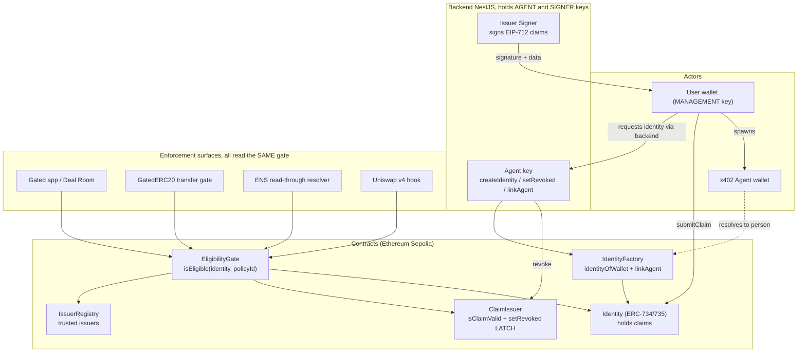
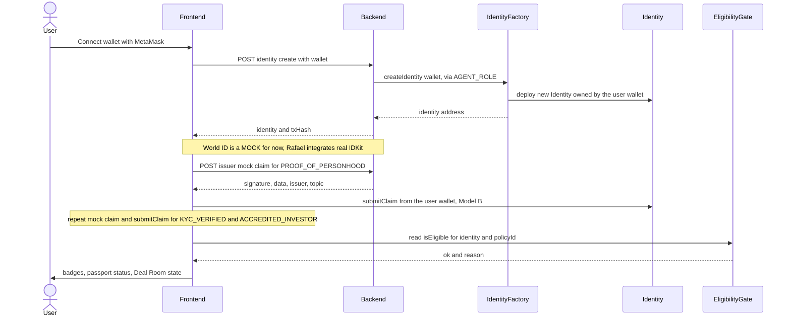
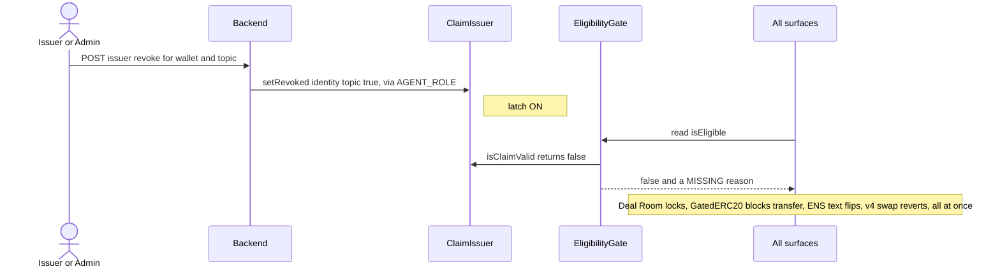
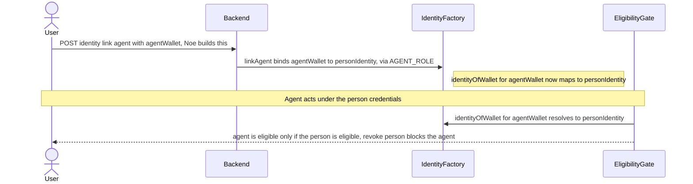

# PassportKit Node — Team Handoff & Frontend Plan

> ETHGlobal Lisbon 2026 (Continuity track). Forked from the public PassportCreds demo.
> **Thesis:** _identity before access, compliance before liquidity._ The demo hero is the **REFUSAL (revocation)**, not the green check.
> Last updated: 2026-07-25.

---

## 1. Status snapshot

| Area | State | Notes |
|---|---|---|
| **Contracts (9)** | ✅ merged to `develop` | Identity, IdentityFactory (+`linkAgent`/`unlinkAgent`), ClaimIssuer, IssuerRegistry, EligibilityGate, GatedERC20, PassportResolver, PassportSubnameRegistrar, Types. **63 tests pass.** |
| **Legacy PassportCreds contracts** | ✅ removed | ClaimRegistry / CompliancePassport / AccessGate + tests + old deploy script deleted. |
| **Deploy script** | ✅ merged | `DeployPassportKit.s.sol` deploys + wires the stack, writes `deployments/<chainid>.json` (addresses + startBlock). |
| **Backend (NestJS) — new** | ✅ merged | `GET /eligibility/:wallet`, `GET /issuer/signer`, `POST /issuer/mock-claim` (DEMO_MODE), `POST /issuer/revoke` (DEMO_MODE). |
| **Backend — legacy** | 🟡 kept, unused | `cre`, `attester`, `verification`, `webhooks`, `passport`, `access`, `transactions`, `wallets` — entangled cluster, revisit later. |
| **Frontend shell** | 🟡 PassportCreds shell | Next.js 14 + viem + Tailwind, MetaMask via `window.ethereum`. Pages `/`, `/passport`, `/deal-room` + components exist. `.env.example` already has PassportKit + World + ENS placeholders. |
| **Deploy to Sepolia** | ❌ not run | Needs `DEPLOYER_PRIVATE_KEY` + RPC + registered ENS name. |
| **Subgraph** | 🟡 starter (Noé) | Indexes events; needs deployed addresses + startBlock from `deployments/<chainid>.json`. |

### Gaps to build
- **Backend (1 new endpoint):** `POST /identity/create` — agent (AGENT_ROLE) calls `IdentityFactory.createIdentity(wallet)`. Mirrors `revocation.service.ts`.
- **Frontend screens:** identity + World + passport, deal-room gate, agent-link. _(No `/admin` screen for the demo — tenant setup is a one-time ops step; in-app admin console is roadmap, see §3a.)_
- **World ID:** real IDKit integration (Rafael) — **mock for now**.
- **Agent linking:** on-chain wiring + endpoint (Noé).
- **Ops:** register + wrap `passportkit.eth` on Sepolia, point its resolver to `PassportResolver`, set `ENS_PARENT_NODE` so the deploy wires the tenant, run deploy, post-deploy `setApprovalForAll(registrar)`, fill `.env` from `deployments/<chainid>.json`.

---

## 2. Architecture



**Key invariants**
- **Model B — no privileged writer:** the issuer only *signs*; the user submits their own claim. Trust = the signature, re-verified at read time by the gate.
- **Revocation = latch** on ClaimIssuer (`setRevoked`). While latched, `isClaimValid` is false → every surface refuses AND no fresh claim can land. Only the issuer re-opens.
- **Agent identity (Model A):** `identityOfWallet[agentWallet] = personIdentity`. The agent inherits the person's eligibility. **Revoke the person → their agents are blocked too.**
- **Zero PII on-chain:** claim `data = abi.encode(dataHash, expiresAt, nonce)` — a hash/reference, never PII.

---

## 3. The new end-to-end flow

### 3a. Tenant setup — one-time OPS, not an app screen

For the demo we register **one** parent name, `passportkit.eth`, up front and wire it once. **There is no `/admin` screen** — the deploy script does the tenant wiring. All test identities hang **below** `passportkit.eth` as subnames (`alice.passportkit.eth`); agents get subnames too.

1. Register + wrap `passportkit.eth` on the ENS app (Sepolia), owned by the ops wallet.
2. Point its resolver to `PassportResolver` (`setResolver`).
3. Set `ENS_PARENT_NODE` (namehash of `passportkit.eth`) in `contracts/.env` → `DeployPassportKit.s.sol` calls `resolver.setTenant(parentNode, gate, policyId, registrar)` automatically at deploy time.
4. Post-deploy (ops wallet): `NameWrapper.setApprovalForAll(registrar, true)` so the registrar can mint subnames.

> **Roadmap (not built for the demo):** an in-app **admin console** where a tenant self-serves this — register a name, pick a policy, wire the tenant from the UI. For the demo it's a scripted ops step; we present the console as the productization path.

### 3b. User — identity, personhood, access



### 3c. The money moment — revoke cascades everywhere



### 3d. Agent identity (x402, Model A)



---

## 4. Screen inventory

| Screen | Route | Purpose | Reads / Writes |
|---|---|---|---|
| **Landing** | `/` | Pitch + nav (My Passport / Deal Room / My Agents). | — |
| **My Passport** | `/passport` | Create identity, verify World (mock), submit claims, show badges + status + eligibility + tx timeline. | **W (BE):** `POST /identity/create`, `POST /issuer/mock-claim` · **W (wallet):** `Identity.submitClaim` · **R:** `GET /eligibility/:wallet`, `factory.identityOfWallet` |
| **Deal Room** | `/deal-room` | Locked / limited / unlocked by eligibility. | **R:** `GET /eligibility/:wallet` (policy #1 & #2) |
| **My Agents** | `/passport#agents` or `/agents` | Link an agent wallet (Model A); show it inherits eligibility; revoke-person demo. | **W (BE):** `POST /identity/link-agent` (Noé) · **R:** eligibility of agent wallet |

**Claim topics:** `KYC_VERIFIED`, `PROOF_OF_PERSONHOOD`, `ACCREDITED_INVESTOR`.
**Policies (from deploy):** `#1 Deal Room = [KYC_VERIFIED]` · `#2 Investor = [KYC_VERIFIED, ACCREDITED_INVESTOR]`.
**Eligibility reasons:** `OK`, `NO_IDENTITY`, `NO_POLICY`, `MISSING_KYC`, `MISSING_PERSONHOOD`, `MISSING_ACCREDITED`, `MISSING_CLAIM`.

### Reuse from the existing shell
`ConnectWalletButton`, `ClaimStatusBadge`, `PassportCard`, `ComplianceProgressStepper`, `AccessDecisionBanner`, `TransactionTimeline`, `DealRoomLocked/Limited/Unlocked` — restyle/rewire, don't rebuild. MetaMask via `metamaskAdapter` (`window.ethereum`); backend via `apiFetch` (`lib/api.ts`); contract writes via a viem `walletClient` over `window.ethereum`.

---

## 5. OPEN DECISION (need a call before/at the afternoon sync)

**Where does World personhood fit in the policies?** Today policies #1/#2 are KYC/accredited only; `PROOF_OF_PERSONHOOD` is a trusted topic but not in any policy (`MISSING_PERSONHOOD` reason already exists).

**Recommendation:** make **personhood the gate for spawning an agent** (Model A: only a verified human spawns agents), and keep KYC/accredited for Deal Room/Investor. Clean story, no contract change (enforce in the link-agent path). Alternative: add policy `#3 = [PROOF_OF_PERSONHOOD]` or require it on Deal Room. **Owner: Luiz Henrique.**

---

## 6. Task breakdown

### Rafael — Frontend screens
> No `/admin` screen for the demo (tenant setup is ops, §3a). Focus on the user + agent surfaces.
- **`/passport`:** "Create my identity" (→ `POST /identity/create`); World ID card (**mock now**: `POST /issuer/mock-claim` topic `PROOF_OF_PERSONHOOD` → `Identity.submitClaim` from user wallet); same pattern for `KYC_VERIFIED` + `ACCREDITED_INVESTOR`; badges + passport status + `GET /eligibility/:wallet`; tx timeline.
- **`/deal-room`:** lock/limited/unlock from eligibility (policy #1 = enter, #2 = invest).
- **World ID (later):** replace the mock card with real IDKit (`NEXT_PUBLIC_WORLD_APP_ID`, `NEXT_PUBLIC_WORLD_ACTION`) → verify proof → sign personhood claim.
- Contract writes: viem `walletClient` over `window.ethereum`; ABIs via `parseAbi` (only the functions used). Addresses from `NEXT_PUBLIC_*` env. Add a labeled **MOCK mode** flag so the UI works before the Sepolia deploy.

### Noé — Subgraph + agent identity + "the show"
- **Subgraph:** index `IdentityCreated`, `AgentLinked`/`AgentUnlinked`, ClaimIssuer revocation events, `GatedERC20 Transfer`; feed it the deployed addresses + `startBlock` from `deployments/<chainid>.json`.
- **Agent identity:** `POST /identity/link-agent` (+ `unlink`) backend endpoint (AGENT_ROLE → `IdentityFactory.linkAgent`); `registrar.issueSubname` path for agent subnames; frontend "My Agents" wiring.
- **The show:** the live view / graph that makes the revoke-cascade visible.

### Luiz Henrique — Ops + glue (afternoon, with the team)
- **Tenant + deploy (Sepolia):** register + wrap `passportkit.eth`, point its resolver to `PassportResolver`; set `ENS_PARENT_NODE` in `contracts/.env` so `DeployPassportKit.s.sol` wires `setTenant` automatically; run the deploy; post-deploy `NameWrapper.setApprovalForAll(registrar, true)`; copy `deployments/11155111.json` into api + web `.env` and the subgraph manifest.
- **Backend:** `POST /identity/create` (thin, mirrors `revocation.service`).
- **Decide** the personhood-policy question (§5).
- Demo script + fallbacks.

---

## 7. Run / env

```
# contracts
cd contracts && forge test            # 63 tests
forge script script/DeployPassportKit.s.sol --rpc-url $RPC_URL --broadcast --verify

# backend
cd apps/api && npm run start:dev       # needs .env (see .env.example) + DEMO_MODE=true for issuer endpoints

# frontend
cd apps/web && npm run dev             # .env.example already lists NEXT_PUBLIC_* contract/World/ENS vars
```

Post-deploy (manual, from the ENS name owner wallet): `NameWrapper.setApprovalForAll(registrar, true)`.

---

_Source of truth: this file + `CLAUDE.md` + `docs/specs/`. AI reviews (Copilot) are advisory — apply real fixes, reject architecture drift._
